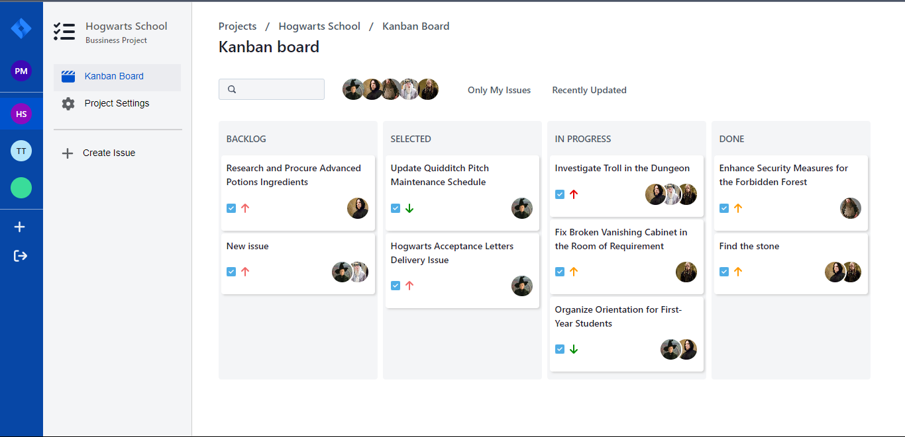

# Jira Clone Project

This is a clone of the popular project management tool Jira, developed using JavaScript, React, Chakra UI for the frontend, and Java Spring Boot, STOMP for backend WebSocket communication, and MongoDB as the database.

## Features

### Creating New Issues
Users can easily create new issues using the intuitive user interface. They can specify details such as title, description, priority, and assignee.

### Making Changes to Issues
Users have the ability to edit and update existing issues. They can modify details, change priorities, assignees, and mark issues as resolved.

### Creating New Projects
The application allows users to create new projects. Projects can have multiple issues associated with them, providing a structured approach to manage tasks.

### Kanban Board
The Kanban board provides a visual overview of the project's progress. It displays issues in different stages (e.g., To Do, In Progress, Done) allowing for easy tracking of tasks.

